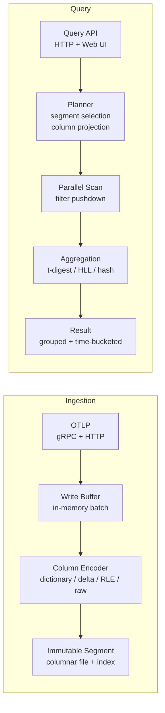
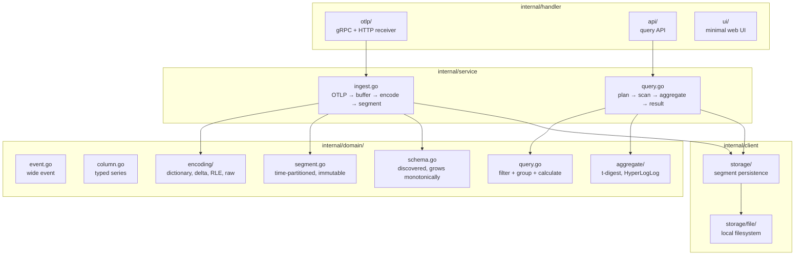

# go-glass

Purpose-built columnar wide-event engine for observability.

Single binary, zero infrastructure dependencies. Accepts OTel spans, stores them in immutable columnar segments, and serves arbitrary high-cardinality queries. Wide events are the only primitive. No three pillars, no separate metrics/logs/traces.

## Data Flow



## Architecture



## Column Encoding

| Type       | Encoding   | Why                                                              |
| ---------- | ---------- | ---------------------------------------------------------------- |
| Strings    | Dictionary | Low-cardinality fields compress well (service name, HTTP method) |
| Timestamps | Delta      | Consecutive timestamps differ by small amounts                   |
| Booleans   | RLE        | Long runs of true/false                                          |
| Numbers    | Raw        | Float64/int64 stored directly                                    |

## Query Model

Not SQL. Observability-specific: time range (required) + filters + breakdowns (GROUP BY) + calculations (COUNT, SUM, AVG, P50, P95, P99, COUNT_DISTINCT).

```
{
  "start": "2026-04-29T00:00:00Z",
  "end": "2026-04-29T01:00:00Z",
  "filters": [{"field": "service.name", "op": "=", "value": "flock"}],
  "breakdowns": ["http.route"],
  "calculations": [{"op": "P99", "field": "duration_ms"}, {"op": "COUNT"}]
}
```

## Go vs Rust Comparison

go-glass has a structural counterpart in [rust-glass](https://github.com/w-h-a/rust-glass). Same domain model and query algebra, different concurrency model. The comparison exercises three categories that matter for storage engines: I/O concurrency, CPU parallelism, and shared state.

| Layer | Go (go-glass) | Rust (rust-glass) | Expected learning |
|-------|--------------|-------------------|-------------------|
| OTLP server | goroutine-per-connection. Blocking code, runtime schedules. | async/await + tokio. Explicit async, lifetimes across await points. | Does Go's implicit model produce simpler ingestion code? Does Rust catch concurrency bugs at compile time that Go only catches with the race detector? |
| Buffer flush | Swap pointer, GC collects old buffer later. Timing is nondeterministic. | Buffer moves into flush task. Ownership transfer, no clone. Dropped deterministically when flush completes. | Does nondeterministic GC timing affect flush latency variance? Does Rust's deterministic drop produce more predictable memory usage under sustained ingestion? |
| Column encoding | goroutines per column, WaitGroup to synchronize. | rayon par_iter with work-stealing thread pool. | Does rayon's work-stealing produce better CPU utilization when columns have uneven sizes? What is the scheduling overhead difference? |
| Query scan | errgroup fans out segment scans. Results collected via channels. | rayon scoped threads. Each scan builds a local owned accumulator. No channel, no sharing. | Does eliminating channels measurably improve query throughput? Does channel send/receive overhead become visible under high query concurrency? |
| Accumulators | Heap-allocated, passed through channels, GC collects after merge. | Stack-owned, moved into merge, dropped after reduce. | For many short-lived accumulators (one per segment per query), does GC pressure become measurable? Does Rust's ownership model eliminate a class of allocation overhead? |
| Schema registry | sync.RWMutex. Race detector validates correctness at runtime. | parking_lot::RwLock. Send + Sync enforced at compile time. | Is parking_lot's spin-before-syscall faster under low contention? Does compile-time thread safety eliminate a class of bugs? |
| Tail latency | GC can pause during query execution. P99 affected by pause timing. | No GC. Query latency is deterministic. | The key production metric. What is the P99 and P999 difference? How often do GC pauses land during queries at homelab scale? |
